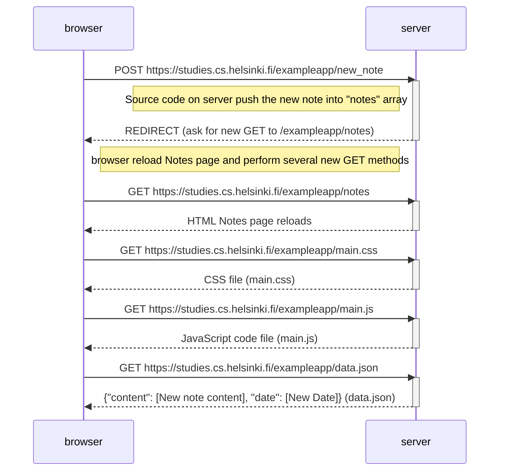

```mermaid
sequenceDiagram

participant browser
participant server

%%User write new note on form and press "Save" Button
browser->>server: POST https://studies.cs.helsinki.fi/exampleapp/new_note
activate server
Note left of server: Source code on server push the new note into "notes" array
server-->>browser: REDIRECT (ask for new GET to /exampleapp/notes)
deactivate server

Note right of browser: browser reload Notes page and perform several new GET methods
browser->>server: GET https://studies.cs.helsinki.fi/exampleapp/notes
activate server
server-->>browser: HTML Notes page reloads
deactivate server

browser->>server: GET https://studies.cs.helsinki.fi/exampleapp/main.css
activate server
server-->>browser: CSS file (main.css)
deactivate server

browser->>server: GET https://studies.cs.helsinki.fi/exampleapp/main.js
activate server
server-->>browser: JavaScript code file (main.js)
deactivate server

browser->>server: GET https://studies.cs.helsinki.fi/exampleapp/data.json
activate server
server-->>browser: {"content": [New note content], "date": [New Date]} (data.json)
deactivate server
```
