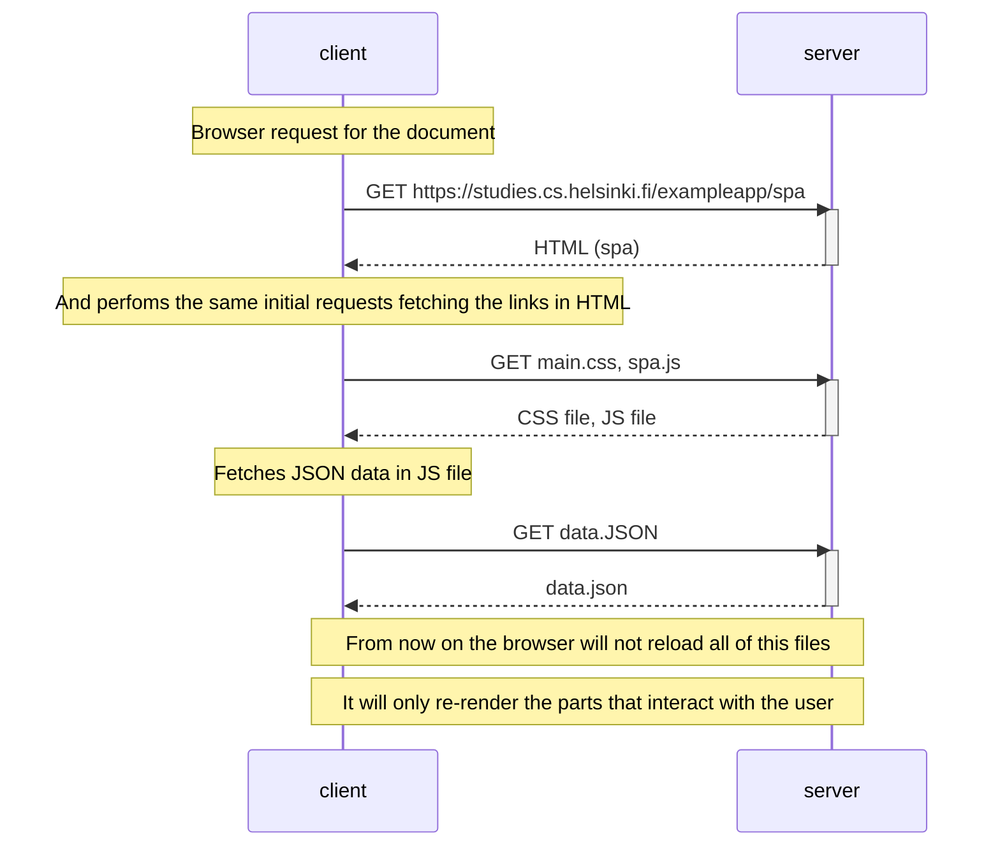

```mermaid
sequenceDiagram

participant A as client
participant B as server

Note over A: Browser request for the document
A->>B: GET https://studies.cs.helsinki.fi/exampleapp/spa
activate B
B-->>A: HTML (spa)
deactivate B

Note over A: And perfoms the same initial requests fetching the links in HTML
A->>B: GET main.css, spa.js
activate B
B-->>A: CSS file, JS file
deactivate B

Note over A: Fetches JSON data in JS file
A->>B: GET data.JSON
activate B
B-->>A: data.json
deactivate B

Note over A, B: From now on the browser will not reload all of this files
Note over A, B: It will only re-render the parts that interact with the user
%%More on next exercise
```
