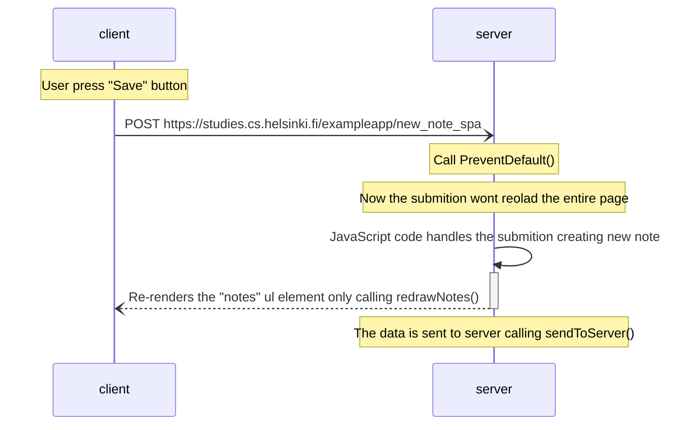

```mermaid
sequenceDiagram

participant A as client
participant B as server

Note over A: User press "Save" button
A-)B: POST  https://studies.cs.helsinki.fi/exampleapp/new_note_spa

Note over B: Call PreventDefault()
Note over B: Now the submition wont reolad the entire page
B->>B: JavaScript code handles the submition creating new note
activate B
B--)A: Re-renders the "notes" ul element only calling redrawNotes()
deactivate B
Note over B: The data is sent to server calling sendToServer()

```
